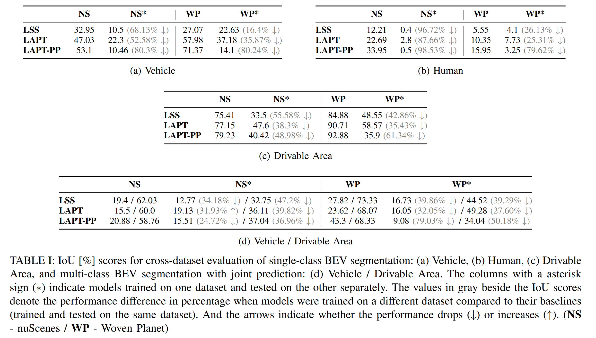

# BEVal: A Cross-dataset Evaluation Study of BEV Segmentation Models for Autononomous Driving

Manuel Diaz-Zapata, Wenqian Liu, Robin Baruffa, Christian Laugier.

To be published at the 18th International Conference on Control, Automation, Robotics and Vision (ICARCV).

[Preprint now available in Arxiv!](https://www.arxiv.org/abs/2408.16322)


## Abstract


This paper addresses the limitation of current research in semantic bird's-eye view (BEV) segmentation for autonomous driving, which typically uses only one dataset for model optimization. We conduct a comprehensive cross-dataset evaluation of state-of-the-art BEV segmentation models to assess their performance across various datasets, setups, and semantic categories. They investigate how different sensors affect model generalization and explore multi-dataset training to improve performance. The study highlights the importance of enhancing model generalizability and adaptability for more robust BEV segmentation in autonomous driving applications.

Key points:

1. Current research often uses single datasets, leading to specialized models prone to domain shift.
2. The paper evaluates BEV segmentation models across multiple datasets and setups.
3. It investigates the impact of different sensors on model generalization.
4. Multi-dataset training experiments are conducted to improve performance.
5. The study emphasizes the need for more generalizable and adaptable models in autonomous driving.

## Installation

### Prerequisites

- Conda environment manager
- Having the trainval or mini split of the nuScenes dataset downloaded ([Link to nuScenes website](https://www.nuscenes.org/nuscenes#download)). 
- Having the training or sample split of the Woven Planet dataset downloaded ([Link to Woven Planet website](https://woven.toyota/en/perception-dataset/)). 

### Setup

1. Clone this repository:
   ```
   https://github.com/manueldiaz96/beval.git
   cd beval
   ```
2. Install the required dependencies following the commands under [install.txt](install.txt)
   - If you have problems installing the environment, please open an [issue](https://github.com/manueldiaz96/beval/issues).
     
3. Set up two shell variables pointing to the dataset repositories in your `.bashrc`:
   ```
   export NUSCENES=/path/to/nuscenes/dataset
   export LYFT=/path/to/woven/planet/dataset
   ```
   - If you plan to use the sample (a.k.a. **mini**) split for the Woven Planet Dataset, also set up the following environment variable:
     ```
     export LYFT_MINI=/path/to/woven/planet/dataset
     ``` 

After completing all these steps, you should have the environment working. You can test this by loading the `beval` environment and launching the following command:

```
python train_lift_splat.py --cfg=configs/lss_lyft_vehicle.yaml
```

## Training a model

To train a model, use the appropriate script with the desired configuration file:

```
python train.py --config config/your_config_file.yaml
```

## Testing a model

To test any of our models please first download the [model zoo](https://drive.google.com/file/d/1_CIjZjkyo3Yos0B8e5_gmlrA_HsKYgek/view?usp=sharing), and extract the files.

Then, launch the test script for the model you require (`lift_splat`, `LAPT` or `LAPT_PP`) as:

```
python test_LAPT.py --cfg path/to/LAPT_config.yaml --weights path/to/LAPT_model.pt
```

## Results

### Cross-dataset evaluation



### Cross-dataset training


## Citation

This work is licensed under [CC BY-NC](LICENSE). If our work has been useful in your research, please consider citing us:

```bibtex
@inproceedings{beval,
  title={BEVal: A Cross-dataset Evaluation Study of BEV Segmentation Models for Autononomous Driving},
  author={Diaz-Zapata, Manuel and Liu, Wenqian and Baruffa, Robin and  Laugier, Christian},
  booktitle={Proceedings of the 18th International Conference on Control, Automation, Robotics and Vision (ICARCV)},
  pages={tbd},
  year={2024}
}

```
